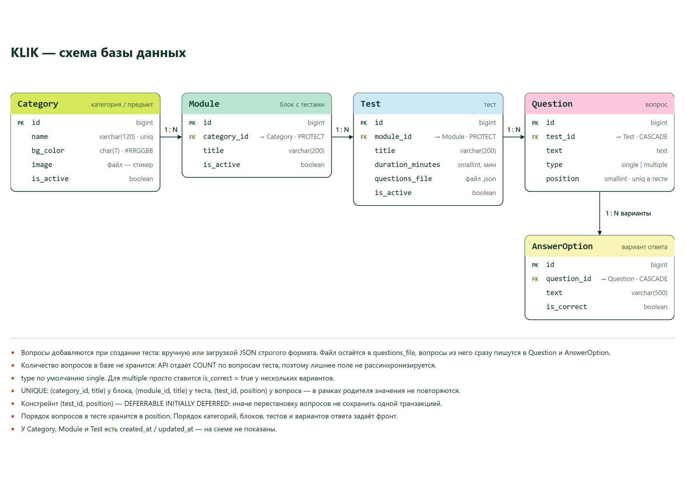
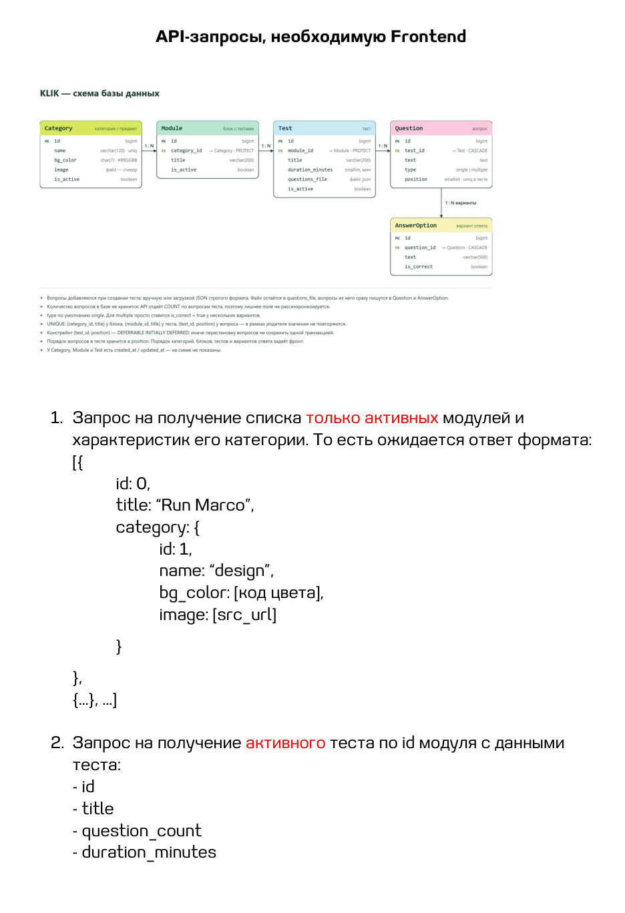
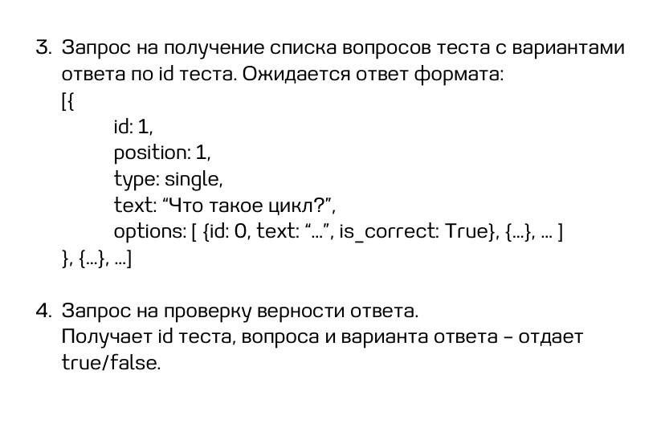

# KLIK

Бэкенд платформы тестов для детей. Каталог, вопросы, API для фронтенда и кабинет,
в котором контент-менеджер заводит тесты сам, не заходя в админку Django.

Авторизации у детей нет, попытки прохождения не сохраняются — персональных данных
в базе нет.

## Схема базы



## Требования к API

Что просил фронтенд:





Два отличия от этого документа:

- `modules/<id>/tests/` вместо `modules/<id>/test/` и массив в ответе — в блоке
  может быть несколько активных тестов.
- `is_correct` в списке вопросов не отдаётся: иначе правильные ответы видно
  во вкладке «Сеть» браузера. Правильность узнаётся запросом проверки.

## Адреса

API — публичный, без авторизации. Скрытое (`is_active = false`) не отдаётся нигде,
даже по прямой ссылке. Списки приходят массивом, без пагинации.

| Адрес | Метод | Что отдаёт |
|---|---|---|
| `/api/v1/modules/` | GET | активные блоки, у каждого — категория с цветом и стикером |
| `/api/v1/modules/<id>/tests/` | GET | активные тесты блока: `id`, `title`, `question_count`, `duration_minutes` |
| `/api/v1/tests/<id>/questions/` | GET | вопросы с вариантами ответа, по `position` |
| `/api/v1/answers/check/` | POST | `{test_id, question_id, option_id}` → `{"is_correct": true}` |
| `/api/v1/health/` | GET | живость сервиса и базы |
| `/api/schema/` · `/api/docs/` | GET | OpenAPI и Swagger, собираются из кода |

Ошибка всегда одного вида: `{"error": {"code", "message", "details"}, "meta": {"request_id"}}`.
Тот же `request_id` уходит в заголовок `X-Request-ID`.

Студия — кабинет контент-менеджера, вход по паролю.

| Адрес | Что |
|---|---|
| `/studio/` | все тесты: блок, категория, количество вопросов, статус; поиск и фильтр |
| `/studio/tests/new/` | новый тест; файл с вопросами необязателен |
| `/studio/tests/<id>/` | вопросы, повторная загрузка файла, правка карточки |
| `/studio/tests/<id>/questions/new/` | вопрос и варианты ответа руками |
| `/studio/modules/new/` · `/studio/categories/new/` | блок и категория |

`/admin/` — админка Django, те же права. Контент-менеджеру она не нужна.

## Как устроено

- `apps/catalog` — категории и блоки. `apps/quizzes` — тесты, вопросы, варианты,
  разбор файла с вопросами. `apps/api/v1` — только четыре запроса контракта.
  `apps/studio` — страницы кабинета, своих моделей у него нет.
- Целостность держит база: названия не повторяются внутри родителя, время теста
  в диапазоне, номер вопроса уникален внутри теста. Констрейнт на номер —
  `DEFERRABLE INITIALLY DEFERRED`, иначе перестановку вопросов не сохранить одной
  транзакцией.
- Количество вопросов в базе не хранится, считается запросом.
- Вопросы загружаются файлом или заводятся руками. Файл разбирается целиком до
  первой записи в базу и пишется одной транзакцией: на ошибке не меняется ничего,
  а в ответе — путь до поля, например `questions → 3 → options → 1 → text`.
  Пример файла — [`docs/examples/questions.json`](docs/examples/questions.json).
- Тест без вопросов на сайт не пускают — правило одно для админки, формы и кнопки.

## Стек

Python 3.13, Django 5.2 LTS, DRF, PostgreSQL 17, pydantic (разбор файла вопросов),
pytest + factory-boy, ruff + mypy (strict) + basedpyright, Docker Compose, uv.
Фронтенда в репозитории нет, кабинет — серверные шаблоны и один файл CSS.

## Запуск

Нужен Docker.

```bash
git clone https://github.com/Kirito-MKD/klik-test-platform.git
cd klik-test-platform
cp .env.example .env
docker compose up -d --build
docker compose exec app python manage.py migrate
docker compose exec app python manage.py setup_content_group
docker compose exec app python manage.py createsuperuser
```

Приложение на http://localhost:8000, база на 5433 (5432 обычно занят локальным
постгресом). Дальше: [студия](http://localhost:8000/studio/) — завести категорию,
блок и тест; [документация API](http://localhost:8000/api/docs/) — посмотреть
и подёргать эндпоинты.

Контент-менеджеру заводят обычного пользователя и добавляют в группу «Контент»
(её создаёт `setup_content_group`). «Статус персонала» нужен, только если человек
должен попадать ещё и в админку.

## Проверки

```bash
docker compose exec app pytest
```

232 теста, покрытие 99%. Без Docker — нужен [uv](https://docs.astral.sh/uv/)
и поднятая база:

```bash
uv sync
docker compose up -d db
uv run pytest
uv run ruff check . && uv run ruff format --check .
uv run mypy . && uv run basedpyright
```

То же самое гоняет CI на каждый push и pull request.

## Прод

Контур собран, но вживую не разворачивался: сервер и домен не выбраны.
`compose.prod.yaml` — gunicorn, PostgreSQL без публикации портов, nginx с TLS;
в `deploy/` — шаблон конфигурации nginx, бэкап с ротацией и сценарий репетиции
восстановления.
